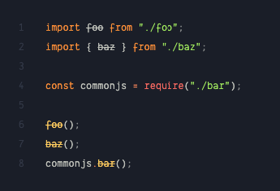

# VS Code JSDocs Deprecated

> Leverage the power of JSDocs. Show deprecated usages in the editor, as you type.

Marks deprecated JavaScript and TypeScript usages in the editor as you type.

VS Code now [supports](https://code.visualstudio.com/updates/v1_49#_deprecated-tag-support-for-javascript-and-typescript) the `@deprecated` JSDoc tag in JavaScript and TypeScript files by default. You may not need the extension anymore.

[Install from the Marketplace](https://marketplace.visualstudio.com/items?itemName=balajmarius.vscode-deprecated)


## Installation

In the Command Palette (**Cmd + Shift + P**) select **Install Extension** and choose **VS Code JSDocs Deprecated**.

## Usage

The extension checks when you open a file, change it, or switch editors. There is no command to run. Install it and work as usual. Deprecated usages are marked in the editor.



## Behind the scenes

The extension plugs into VS Code and uses hover information to find deprecated identifiers. If the project is configured properly and hover shows the deprecated warning, the extension shows it too.

## Development

```bash
npm install
npm run compile
```

- `npm run watch` — compile on change.
- `npm run lint` — lint `src`.

## License

[MIT](LICENSE).
